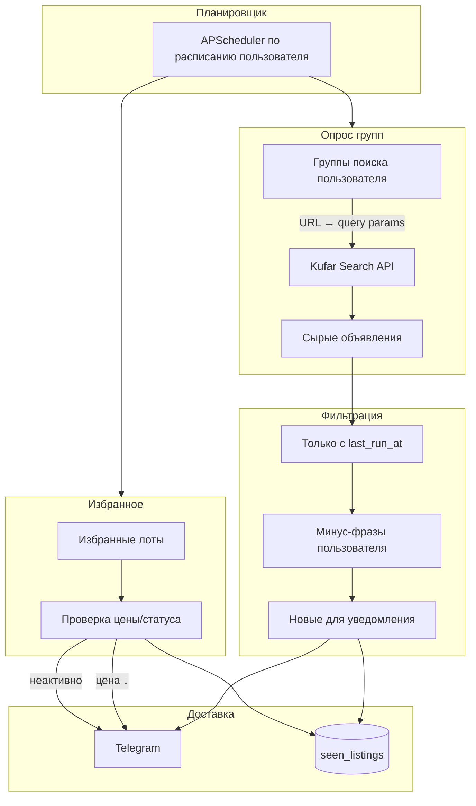

# Архитектура Kufar Bot

## Поток данных



## Модули

| Модуль | Назначение |
|--------|------------|
| `bot/` | Telegram UI: команды, FSM для настроек, авторизация |
| `kufar/` | HTTP-клиент (curl_cffi), парсинг URL → API params, модели объявлений |
| `services/` | Бизнес-логика: опрос, фильтры, избранное, планировщик |
| `db/` | SQLAlchemy модели, миграции Alembic |
| `config.py` | Настройки из `.env` |

## База данных

### users
- `telegram_id` (PK)
- `is_authorized`
- `created_at`

### search_groups
- `id`, `user_id`, `name` (напр. «Сад»)
- `section_label`, `region_label` (человекочитаемые подписи)
- `search_url` (исходная ссылка отбора с kufar.by)
- `api_query` (JSON — распарсенные параметры для API)
- `is_active`, `created_at`

### negative_phrases
- `id`, `user_id`
- `phrase` (текст или regex)
- `is_regex` (bool)
- `scope` — `global` или `group_id`

### poll_runs
- `id`, `user_id`, `started_at`, `finished_at`
- Окно «новых» объявлений: `list_time > previous_run.finished_at`

### seen_listings
- `user_id`, `ad_id`, `group_id`
- `first_seen_at`, `notified_at`
- UNIQUE(user_id, ad_id, group_id)

### favorites
- `id`, `user_id`, `ad_id`
- `title`, `url`, `last_price`, `currency`
- `last_checked_at`, `is_active`
- `price_drop_notified` (опционально — не спамить на каждый тик)

### schedules
- `user_id` (PK)
- `runs_per_day` (1–24)
- `run_times` (JSON: `["08:00", "14:00", "20:00"]`) или интервал
- `timezone` (по умолчанию `Europe/Minsk`)

## Kufar API

Основной endpoint (проверен):

```
GET https://api.kufar.by/search-api/v2/search/rendered-paginated
```

Параметры берём из URL пользователя (`cat`, `rgn`, `ar`, `query` и т.д.).
Сортировка по дате: `sort=lst.d`. Поле `list_time` — ISO datetime.

`curl_cffi` используем для:
- обхода защиты при 403/Cloudflare на API или карточках лота;
- impersonate браузера (`chrome` / `safari`).

## Авторизация

- `ADMIN_TELEGRAM_ID` — вы; только админ добавляет пользователей (`/allow <id>`).
- Неавторизованным — сообщение «напишите администратору @...».

## Логика «сегодня / с последнего опроса»

Не храним все объявления навсегда. На каждом опросе:
1. Берём `finished_at` предыдущего `poll_run` (или `now - 24h` для первого запуска).
2. Из API забираем объявления с `list_time > watermark`.
3. Минус-фразы отсекают остальное.
4. То, что уже в `seen_listings` для этой группы — пропускаем.
5. Новое — в Telegram + запись в `seen_listings`.

## Избранное

Отдельная задача (чаще основного опроса, напр. каждые 2–4 ч):
- GET по `ad_id` (API или страница лота).
- Цена снизилась → уведомление.
- Статус неактивен / 404 → пометить `is_active=false`, уведомить, опционально удалить.
